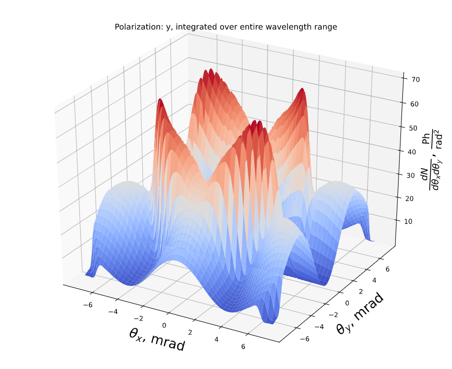

# wigrad
Caclulates the spectral-angular distribution of the number of photons emitted by one electron in a wiggler.

Simply do

`pip install wigrad`

to install this package.

The analytical expressions from the book "The Science and Technology of Undulators and Wigglers" by James A. Clarke are used, pp. 66-67.

Please see `demo.ipynb` for an example of how to use the module `wigrad.py`. This example uses the undulator from SLAC (for details see https://arxiv.org/pdf/1912.06737.pdf), the electorn energy is 100 MeV.

